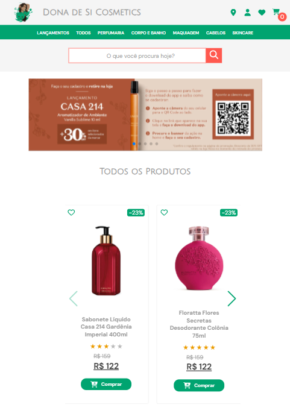

[PROJECT__BADGE]: https://img.shields.io/badge/📱Visit_this_project-000?style=for-the-badge&logo=project
[PROJECT__URL]: https://cosmetics-sales.vercel.app/

<h1 align="center" style="font-weight: bold;">Dona de Si Cosmetics 💻</h1>

    <a href="#about">Sobre</a> • 
    <a href="#started">Getting Started</a> • 
     

    

<h2 id="about">📌 Sobre</h2>

  <b>Projeto desenvolvido durante o programa Desenvolve da Boticário em parceria com a Alura.</b> 
  O objetivo do desafio foi a criação de um site na seção de produtos de beleza e cosméticos. 
  O projeto foi desenvolvido em 3 etapas durante o programa, a primeira etapa foi a construção de site responsivo usando somente HTML e CSS, a segunda etapa a inclusão de interatividade com manipulação do DOM e a terceira etapa foi a construção de uma API e a integração com o front-end e banco de dados. 

[![project][PROJECT__BADGE]][PROJECT__URL]

<h2 id="started">🚀 Getting started</h2>

<h3>Pré - Requisitos</h3>

- Para rodar localmente é necessário primeiro subir o servidor da API no repositório https://github.com/pamelaprpn/backend_cosmetics.

<h2 id="colab">🤝 Colaboradores</h2>

<table>
    <tr>
        <td align="center">
        <a href="#">
             
            
            <b>Pâmela Raiane</b>
            
        </a>
        </td>
    </tr>
</table>